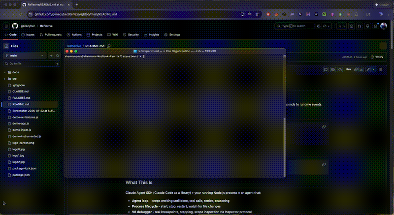

# Reflexive



[View full video (mp4)](demo1_clipped_4x.mp4)

Embed Claude inside your running Node.js app. It sees logs, reads source, edits files, sets breakpoints, and responds to runtime events.

## Quickstart

```bash
echo "console.log('hello')" > app.js
npx reflexive --write app.js
# Open http://localhost:3099
# Say: "Turn this into an Express server with a /users endpoint"
```

## Oneliner
```bash
npm i -g reflexive 
echo "console.log('hello')" > app.js; reflexive --write --inject --open app.js
```

## Versions

As of v0.2.0, the default `reflexive` command uses:
- **TypeScript CLI** - Modular architecture with separate managers for process, sandbox, and debugging
- **Next.js Dashboard** - Modern React UI with real-time log streaming, ANSI color support, and watch triggers

The original single-file JavaScript version is still available:

```bash
# Use legacy single-file JavaScript version
reflexive-legacy ./app.js
```

Both versions have the same CLI interface and capabilities.

## What This Is

Claude Agent SDK (Claude Code as a library) + your running Node.js process = an agent that:

- **Agent loop** - keeps working until done, tool calls, retries, reasoning
- **Process lifecycle** - start, stop, restart, watch for file changes
- **V8 debugger** - real breakpoints, stepping, scope inspection via Inspector protocol
- **Watch triggers** - pattern-match logs and auto-prompt the agent
- **File read/write + shell** - behind explicit flags

```
+---------------------------------------------------------+
|  reflexive CLI                                          |
|  - Dashboard server (chat UI + logs)                    |
|  - Claude Agent SDK with MCP tools                      |
|  - Process control, file ops, shell                     |
|                                                         |
|  +---------------------------------------------------+  |
|  |  your-app.js (child process)                      |  |
|  |  - stdout/stderr captured                         |  |
|  |  - Optional: deep instrumentation via --inject    |  |
|  +---------------------------------------------------+  |
+---------------------------------------------------------+
```

## Safety Model

**Default is read-only.** No flags = agent can see logs, read files, ask questions. Cannot modify anything.

Capabilities require explicit opt-in:

| Flag | Enables |
|------|---------|
| `--write` | File modification |
| `--shell` | Shell command execution |
| `--inject` | Deep instrumentation (console intercept, diagnostics, perf metrics) |
| `--eval` | Runtime code evaluation (implies --inject) |
| `--debug` | V8 Inspector debugging (breakpoints, stepping, scope inspection) |

This is a development tool. For production, use read-only mode.

## Authentication

Choose one:

```bash
# Option 1: Claude Code CLI (recommended)
npm install -g @anthropic-ai/claude-code
claude  # Login once

# Option 2: API key
export ANTHROPIC_API_KEY=your-key
```

---

## CLI Reference

```bash
reflexive [options] [entry-file] [-- app-args...]
```

### Options

```
-p, --port <port>       Dashboard port (default: 3099)
-h, --host <host>       Dashboard host (default: localhost)
-o, --open              Open dashboard in browser
-w, --watch             Restart on file changes
-i, --interactive       Proxy stdin/stdout for CLI apps
    --inject            Deep instrumentation
    --eval              Runtime eval (DANGEROUS)
-d, --debug             V8 Inspector debugging
    --write             Enable file writing
    --shell             Enable shell access
    --dangerously-skip-permissions  Enable everything
    --node-args <args>  Pass args to Node.js
```

### Examples

```bash
# Basic - read-only monitoring
npx reflexive ./server.js

# Development - full control
npx reflexive --write --shell --watch ./server.js

# Debugging - set breakpoints, step through code
npx reflexive --debug ./server.js

# Deep instrumentation - GC stats, event loop, HTTP tracking
npx reflexive --inject ./server.js

# Pass args to your app
npx reflexive ./server.js -- --port 8080
```

## Library Mode

Embed the agent inside your app for deeper introspection:

```javascript
import { makeReflexive } from 'reflexive';

const r = makeReflexive({
  port: 3099,
  title: 'My App',
  tools: []  // Add custom MCP tools
});

// Console output captured automatically
console.log('Server started');

// Expose custom state the agent can query
r.setState('activeUsers', 42);
r.setState('cache.hitRate', 0.95);

// Programmatic chat
const answer = await r.chat("What's the memory usage?");
```

### Custom Tools

```javascript
import { tool } from '@anthropic-ai/claude-agent-sdk';
import { z } from 'zod';

const r = makeReflexive({
  tools: [
    tool(
      'get_order',
      'Look up order by ID',
      { orderId: z.string() },
      async ({ orderId }) => ({
        content: [{ type: 'text', text: JSON.stringify(orders.get(orderId)) }]
      })
    )
  ]
});
```

## V8 Debugger

With `--debug`, the agent can set real breakpoints:

```
You: "Set a breakpoint on line 42 of server.js"
Agent: [set_v8_breakpoint: file="server.js", line=42]
       Breakpoint set.

... request comes in ...

Agent: Breakpoint hit at server.js:42

       Call Stack:
       - handleRequest (server.js:42)
       - processMiddleware (middleware.js:18)

       Local Variables:
       - req: { method: "POST", url: "/api/users" }
       - user: { id: 123, name: "Alice" }

You: "What's in user.permissions?"
Agent: [evaluate_at_breakpoint: "user.permissions"]
       ["read", "write", "admin"]

You: "Step into the next function"
Agent: [debugger_step_into]
       Stepped to validateUser (auth.js:55)
```

## Watch Triggers

Click the eye icon on any log entry to create a watch. When that pattern appears again, the agent is automatically prompted.

Use cases:
- "When you see 'Error:', investigate and suggest a fix"
- "When 'user signed up' appears, summarize the signup"
- "When memory exceeds 500MB, analyze what's using it"

## Injection Mode

With `--inject`, your app gets automatic instrumentation without code changes:

| What's Captured | Source |
|-----------------|--------|
| Console methods | log, info, warn, error, debug |
| HTTP requests | Incoming and outgoing via diagnostics_channel |
| GC events | Duration and type |
| Event loop | Latency histogram (p50, p99) |
| Uncaught errors | With stack traces |

Your app can optionally use the injected API:

```javascript
if (process.reflexive) {
  process.reflexive.setState('db.connections', pool.size);
  process.reflexive.emit('userSignup', { userId: 123 });
}
```

## Runtime Eval

With `--eval`, the agent can execute code in your running app:

```
You: "What's in the config object?"
Agent: [evaluate_in_app: code="config"]
       { port: 3000, debug: true }

You: "Clear the cache"
Agent: [evaluate_in_app: code="cache.clear()"]
       undefined
```

**Warning:** `--eval` allows arbitrary code execution. Development only.

## Dashboard

The web UI at `http://localhost:3099` provides:

- Real-time chat with the agent
- Live logs with ANSI color support
- Process controls (stop/restart)
- Watch pattern management
- Breakpoint controls (with --debug)

## Demos

```bash
npm run demo          # Library mode - task queue
npm run demo:app      # CLI mode - HTTP server
npm run demo:inject   # Deep instrumentation
npm run demo:eval     # Runtime eval
npm run demo:ai       # AI-powered endpoints
```

---

## Links

- Built on [Claude Agent SDK](https://docs.anthropic.com/en/docs/claude-code/agent-sdk) (Claude Code as a library)
- TypeScript CLI with Next.js dashboard (legacy single-file version available via `reflexive-legacy`)
- [Troubleshooting](./FAILURES.md)

## License

MIT
